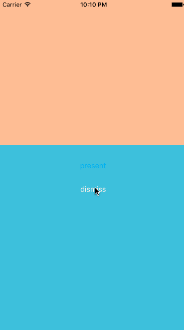
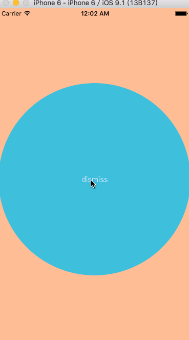

# VCTransitions
TransitionsDemo


  


---


动画示例：

```
-(NSTimeInterval)transitionDuration:(id<UIViewControllerContextTransitioning>)transitionContext {
    return 0.8f;
}

- (void)animateTransition:(id <UIViewControllerContextTransitioning>)transitionContext {
      //  1、取出要跳转到的 VC

    UIViewController *toVC = [transitionContext viewControllerForKey:UITransitionContextToViewControllerKey];
    
     //   2 、设置 toVC frame

    CGRect screenBounds = [UIScreen mainScreen].bounds;
    
    CGRect finalFrame = [transitionContext finalFrameForViewController:toVC];

    toVC.view.frame = CGRectMake(0, screenBounds.size.height, screenBounds.size.width , screenBounds.size.height);
    
     //  3 、把 toVC 添加到容器中

    UIView *containerView = [transitionContext containerView];
    
    [containerView addSubview:toVC.view];
    
     ////  4、动画

    NSTimeInterval duration = [self transitionDuration:transitionContext];
    
    [UIView animateWithDuration:duration
                          delay:0.0
         usingSpringWithDamping:0.6
          initialSpringVelocity:0.0
                        options:UIViewAnimationOptionCurveEaseOut
                     animations:^{
                         toVC.view.frame = CGRectMake(0, finalFrame.size.height * (7/16.0), finalFrame.size.width, finalFrame.size.height* (9/16.0));
                     } completion:^(BOOL finished) {
                       
        //    5、告诉 context 动画结束

                         [transitionContext completeTransition:YES];
                     }];
    

```